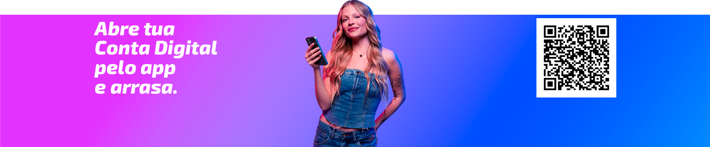

## **Exercício: Adicionando Imagens**
Dando sequência ao exercício anterior, adicione uma imagem representativa da conta digital.

### **Instruções:**
- Logo após o link adicionado, adicione a imagem representativa abaixo usando a tag ``: 

- A imagem deve conter o texto alternativo "Banner da Conta Digital"
